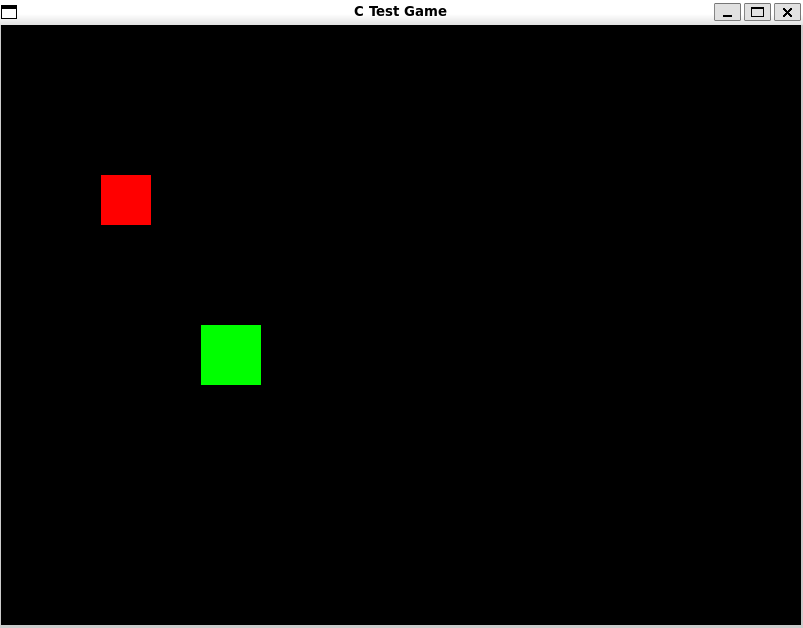

# Building a Game Engine with Rust from the Ground Up

This is my implementation of Udacity's Introduction to Rust project, I restructured the project to separate concerns
and make the introduction of binary modules like the test-game.

The wrapper library around GLFW is now in the game_engine project, the project is a Rust Library that compiles 
the C Library and the wrappers around using Cargo. 

## Getting Started

The original repository is Linux centric and does not work out of the box in MacOS.


### Local environment prerequisites

I extended the Makefile to work compile in MacOS, but it requires a working homebrew installation with
the GLFW and sdl2 libraries installed:

```bash
brew install glfw
brew install sdl2
```

Besides that OpenGL development requires and XCode Command Line Tools installation.

I have not tested the build in a Linux or window machine after the modifications, 
for Linux/Window instructions please check Udacity's original repository.

```bash
curl --proto '=https' --tlsv1.2 -sSf https://sh.rustup.rs | sh
```

Also, because we are dealing with C code in this project, you'll need to have a C compiler installed on your machine. You can install the `build-essential` package, which includes the GNU C Compiler (GCC) and other necessary tools:

```bash
sudo apt update
sudo apt install build-essential
```

Finally, you'll need to have GLFW installed in your machine. GLFW is a C library that will be the foundation of our game engine. You can install it with:

```bash
sudo apt install libglfw3 libglfw3-dev
```

### Running the Test C Game

To start with your project, clone this repository to your local machine:

```bash
git clone https://github.com/udacity/intro-to-rust-starter.git
# or, git clone git@github.com:udacity/intro-to-rust-starter.git
```

To ensure you are set up correctly, you can run the test C game that comes with this project. You can build and run the test game with:

```bash
cd intro-to-rust-starter/starter
make run-c
```

You should see the following pop-up window:



### Starting the Rust Game Engine

With this done, we are ready to start creating our game engine project. Inside the `starter` folder, create a new Rust library project called `my_game_engine` (or whatever name you prefer), and then refer to the project instructions in the Udacity website to start building your game engine.

> Note: If you choose another name for your engine, you must update the references to `my_game_engine` in the `starter` folder's `Makefile` to reflect the new name.

## License

[License](LICENSE.txt)
